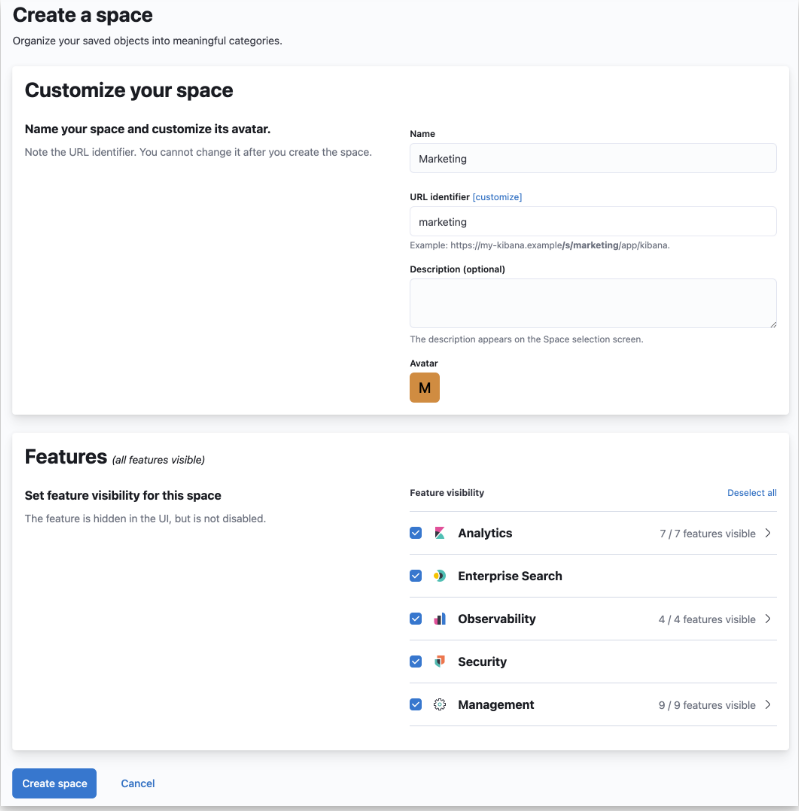
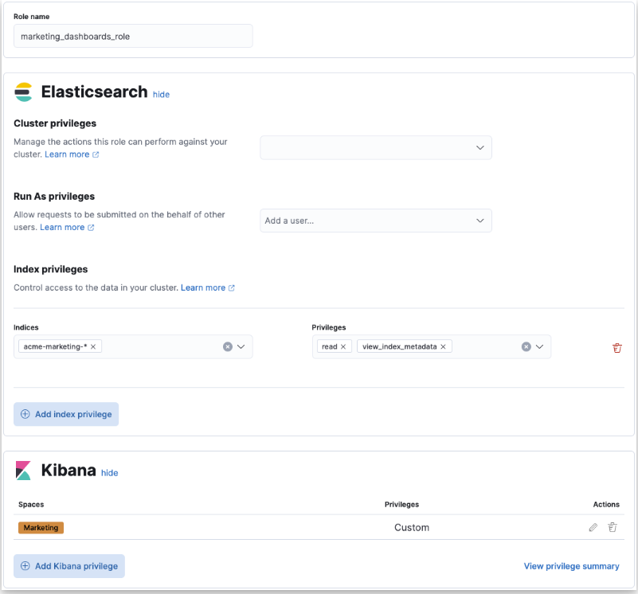
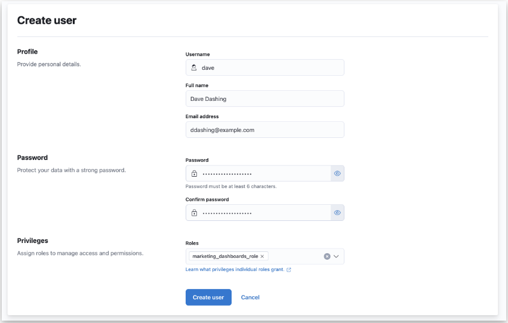
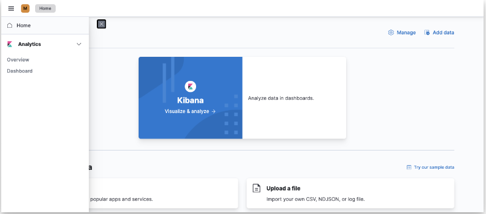

# Securing access to Kibana
Kibana は、データを最大限に活用するための強力な機能を備え、ますます充実しています。データは重要であり、保護されるべきものです。Kibana を使用すると、データへのアクセスを保護し、ユーザーがデータにアクセスする方法を制御することができます。

例えば、素晴らしいダッシュボードを見るだけのユーザーもいれば、Elasticエージェントのフリートを管理したり、ネットワーク内の異常な動作を検出するための機械学習ジョブを実行したりする必要があるユーザーもいるでしょう。

このガイドでは、Kibanaの3つのセキュリティ機能、スペース、ロール、およびユーザーを紹介します。このチュートリアルの終わりには、これらのエンティティを管理する方法と、Kibana とデータの両方へのアクセスを保護するためにこれらを活用する方法について学習します。

## Spaces
複数のチームやテナントで Kibana を使用していますか？新しいビジュアライゼーションやルールを試すための「遊び場」が必要ですか？もしそうなら、Kibana スペースが役に立ちます。

スペースは、Kibana の別のインスタンスとお考えください。スペースでは、ダッシュボード、ルール、機械学習ジョブなどを独自のカテゴリに整理することができます。たとえば、マーケティング担当者がキャンペーンの結果を追跡するためのマーケティング・スペースや、開発者がアプリケーションのパフォーマンスを監視するためのエンジニアリング・スペースを用意することができます。

あるスペースで作成したアセットは、他のスペースから分離されるため、スペースに入ると、そのスペースに属するアセットだけが表示されます。

詳細については、「スペース」のドキュメントを参照してください。

## Roles
スペースを設定したら、アクセスを確保するための次のステップは、ロールをプロビジョニングすることです。ロールとは、KibanaとElasticsearchでアクションを実行するための権限の集合体です。ロールは、ユーザーと、Elastic Stackを動かすシステムアカウントに割り当てられます。

独自のロールを作成することもできますし、ビルトインのロールを使用することもできます。ビルトインロールの中には、Elastic Stackのコンポーネントを対象としたものがあり、エンドユーザーに直接割り当てないほうがよいものもあります。

より便利なビルトインロールの1つにkibana_adminがあります。このロールをユーザーに割り当てると、Kibanaのすべての機能へのアクセスが許可されます。これには、Spacesを管理する機能も含まれます。

ビルトインのロールは、Elastic Stackを使い始めるときや、より限定的なアクセスを必要としないシステム管理者に最適です。しかし、多くの機能があるため、すべての人のニーズに合わせてより詳細なロールを作成することはできません。そこで、カスタムロールの出番です。

管理者は独自のロールを作成し、ユーザーが持つべきアクセスの種類を正確に記述することができます。たとえば、marketing_userロールを作成して、マーケティング部門のすべてのユーザーに割り当てるとします。このロールは、このチームが成功するために必要なすべてのデータと機能へのアクセスを許可し、必要でないアクセスは許可しません。

## Users
ロールを設定したら、アクセスを確保するための次のステップは、ユーザーを作成し、1つまたは複数のロールを割り当てることです。Kibana のユーザー管理では、各ユーザーにアカウントをプロビジョニングすることができます。

シングルサインオンをお望みですか？Kibana は、SAML、OIDC、LDAP/AD、Kerberos など、さまざまな SSO 実装をサポートしています。Kibana の SSO 機能の詳細については、こちらをご覧ください。

## Example: Create a user with access only to dashboards
では、その例を一緒に見てみましょう。キャンペーンの効果を監視したいマーケティング・アナリストを考えてみましょう。彼らは自分のチームのダッシュボードを見ることができるはずですが、Kibana で他のものを見たり管理したりすることは許可されていません。このチームのダッシュボードはすべて「Marketing」スペースにあります。

### Create a space
マーケティングアナリストが使用するためのマーケティングスペースを作成します。

1. メインメニューを開き、[Stack Management]を選択します。
2. Kibana」の下にある「Spaces」を選択します。
3. Create a space]をクリックします。
4. このスペースに一意の名前を付けます。たとえば、次のようになります。マーケティング」。
5. Create space］をクリックします。

上記の例に従った場合、次のようなスペースができあがります。

### Create a role
ダッシュボードを効果的に使用するために、付与したい権限を記述したロールを作成します。この例では、マーケティングアナリストが必要となります。

- ダッシュボードを動かすデータの閲覧権限
- マーケティングスペース内のダッシュボードを閲覧するためのアクセス権

ロールを作成するには

1. メインメニューを開き、[Stack Management]を選択します。
2. Securityで[Roles]を選択します。
3. ロールの作成]をクリックします。
4. このロールに一意の名前を付けます。例：marketing_dashboards_role。
5. この例では、すべてのマーケティングデータをインデックスのacme-marketing-* セットに格納したいとします。このアクセスを許可するには、[Index privileges]セクションを探し、次のように入力します。

  a. インデックス]フィールドに "acme-marketing-*"と入力します。
  b. Privilegesフィールドにreadとview_index_metadataを入力する。

複数のパターンのインデックスを追加し、それぞれに異なるアクセスレベルを付与することができます。追加のアクセス権を付与するには、［インデックス特権の追加］をクリックします。

6. マーケティングスペースのダッシュボードへのアクセスを許可するには、［Kibana］セクションを探し出し、［Kibana権限の追加］をクリックします。

  a. Spacesドロップダウンから、［Marketing］スペースを選択します。
  b. Analytics］セクションを展開し、［Dashboard］の［読み取り］特権を選択します。
  c. Kibana 特権を追加] をクリックします。
7. ロールの作成をクリックします。

上記の例に従った場合、最終的に以下のようなロールが作成されるはずです。

### Create a user
ロールを作成したので、ユーザーアカウントを作成します。

1. Stack Managementに移動し、[Security]で[Users]を選択します。
2. Create userをクリックします。
3. このユーザーに分かりやすいユーザー名を与え、安全なパスワードを選択します。
4. 以前に作成したmarketing_dashboards_roleをこの新しいユーザーに割り当てます。
5. Create userをクリックします。

### Verify
ユーザーとロールが正しく動作していることを確認します。

1. すでにログインしている場合は、Kibanaをログアウトします。
2. ログイン画面で、作成したアカウントのユーザー名とパスワードを入力します。

マーケティングスペースに移動し、メインナビゲーションにはDashboardアプリケーションのみが表示されます。

## What’s next?
このガイドは、Kibana のセキュリティ機能を紹介するものです。ユーザーの認証と権限付与の詳細については、これらの追加リソースを確認してください。

- シングルサインオンおよびその他のログイン機能の詳細については、認証ガイドを参照してください。
- Kibana の機能へのアクセスを承認する方法の詳細については、承認ガイドを参照してください。

まだ質問がありますか? Kibanaに関するディスカッションフォーラムで質問すれば、コミュニティのメンバーやElasticのエンジニアがお手伝いします。
